# 👁️ Awesome Computer Vision API 🚀

  

  
  
  
  
  
  

---

## 💡 Overview & Introduction

Welcome to **Awesome Computer Vision API** — a comprehensive, developer-first curated directory of **Computer Vision SaaS Platforms**, **Hosted Vision APIs**, and **Open-Source Computer Vision Frameworks**. 

Whether you are looking to integrate pretrained image recognition models, object detection, OCR (Optical Character Recognition), facial analysis, zero-shot segmentation, or deploy production-grade self-hosted vision microservices, this list features category-leading options compared by enterprise size, pricing, free tiers, and GitHub stars.

---

## 📖 Table of Contents

- [☁️ SaaS & Hosted Computer Vision Platforms](#%EF%B8%8F-saas--hosted-computer-vision-platforms)
- [🔓 Open-Source Computer Vision Frameworks & Libraries](#-open-source-computer-vision-frameworks--libraries)
- [🤝 How to Contribute](#-how-to-contribute)
- [💖 Support & Sponsorship](#-support--sponsorship)
- [⚠️ Disclaimer](#%EF%B8%8F-disclaimer)
- [📈 Star History](#-star-history)

---

## ☁️ SaaS & Hosted Computer Vision Platforms

> **📊 Market Context & Industry Structure**: The global computer vision market size is estimated at **~$20 Billion in 2026** and is projected to reach **~$50 Billion by 2032**, growing at a **~16% CAGR**. The sector is **moderately fragmented** — hyperscalers (AWS, Google Cloud, Microsoft Azure) bundle vision APIs as part of cloud ecosystems, while specialized MLOps platforms (Roboflow, Clarifai, Landing AI, V7) compete dynamically on custom model training, dataset annotation, and edge deployment pipelines. There is no single winner-take-all monopoly, making multi-vendor and hybrid open-source/cloud architectures standard across enterprise ML teams.

### 🏢 SaaS Comparison Matrix (Sorted by Company Size / Revenue Descending)

| Platform | Description | Pricing (Starting Paid Tier) | Free Tier Limits / Free Trial | Company Size (Revenue / Valuation) |
| :--- | :--- | :--- | :--- | :--- |
| **[AWS Rekognition](https://aws.amazon.com/rekognition/)** | AWS's deep learning image/video analysis API for face detection, object labeling, content moderation, and video tracking. | **Pay-as-you-go**: **$1.00 per 1,000 images** (Group 1 features like Label Detection). | **AWS Free Tier**: **5,000 images/month** for 12 months for new accounts. | **~$638B Revenue** *(Amazon FY2025)* |
| **[Google Cloud Vision API](https://cloud.google.com/vision)** | Google's vision API for label detection, document OCR, face/landmark detection, and explicit content detection. | **Pay-as-you-go**: **$1.50 per 1,000 images** (first 1K free/month). | **Free Tier**: **1,000 feature requests/month** forever + 5 GB Cloud Storage. | **~$350B Revenue** *(Alphabet FY2025)* |
| **[Microsoft Computer Vision AI](https://azure.microsoft.com/en-us/products/ai-services/ai-vision)** | Azure AI Vision service offering OCR, image analysis, visual tagging, face verification, and spatial analysis. | **S1 Standard**: **$1.00 per 1,000 transactions** (Image Analysis). | **F0 Free Tier**: **5,000 transactions/month** (max 20 trans/min, 500 training images). | **~$281B Revenue** *(Microsoft FY2025)* |
| **[Hive Vision API](https://thehive.ai/)** | Deep learning API suites specialized in visual content moderation, image generation verification, and video intelligence. | **Pay-as-you-go**: **$3.00 per 1,000 images** (Visual Moderation). | **Developer Free Tier**: **100 requests/day** with default API key. | **Private (~$120M+ Raised)** |
| **[Clarifai](https://www.clarifai.com/)** | Full-stack AI platform for computer vision, NLP, and custom model training via gRPC and REST APIs. | **Freemium Usage**: **$1.20/month base** + usage-based model calls. | **Community Free Plan**: **1,000 free operations/month**. | **Private (~$100M+ Raised)** |
| **[Roboflow](https://roboflow.com/)** | End-to-end vision platform: image annotation, dataset management, automated model training, and serverless inference. | **Pay-as-you-go**: **$0.001 per serverless API call**. | **Core Free Plan**: **10 credits/month** (~80,000 inferences) + **Self-hosted inference FREE**. | **Private (~$80M+ Raised)** |
| **[V7 Darwin](https://www.v7labs.com/)** | Automated dataset annotation platform and generative document processing for enterprise CV workflows. | **Pro Plan**: **$299/month** (includes platform seats and compute units). | **14-Day Free Trial**: Full access with demo dataset and 100 auto-label credits. | **Private (~$50M+ Raised)** |
| **[SuperAnnotate](https://www.superannotate.com/)** | Data curation and vector annotation workspace for multimodal AI and computer vision models. | **Starter Plan**: **$199/month** platform access fee. | **14-Day Free Trial**: Available upon developer registration with 500 free items. | **Private (~$50M+ Raised)** |
| **[Nyckel](https://www.nyckel.com/)** | Fast, automated micro-API generator for image classification, object detection, and visual search. | **Pay-as-you-go**: **$0.005 per API invoke**. | **Free Tier**: **100 invokes/month**, up to 200 training samples, 5 functions. | **Private (~$20M+ Raised)** |
| **[Landing AI](https://landing.ai/)** | Visual inspection and Agentic Document Extraction (ADE) platform founded by Andrew Ng. | **Team Plan**: **$50/month** (includes 2,500 inference credits). | **Explore Plan**: **1,000 free credits** (valid for 90 days after signup). | **Private (Andrew Ng-backed)** |

---

## 🔓 Open-Source Computer Vision Frameworks & Libraries

Sorted by **GitHub Star Count (Descending)**.

| Repo | Description | Stars |
| :--- | :--- | :--- |
| **[Transformers (Hugging Face)](https://github.com/huggingface/transformers)** | State-of-the-art Machine Learning & Computer Vision (ViT, DETR, SAM, Depth Anything, CLIP, Florence-2). **Apache-2.0**. |  |
| **[OpenCV](https://github.com/opencv/opencv)** | The premier open-source real-time computer vision and image processing library with 2,500+ algorithms. **Apache-2.0**. |  |
| **[PaddleOCR](https://github.com/PaddlePaddle/PaddleOCR)** | Multilingual Optical Character Recognition (OCR) toolkit supporting 80+ languages, layout analysis, and table recognition. **Apache-2.0**. |  |
| **[Segment Anything (SAM)](https://github.com/facebookresearch/segment-anything)** | Meta AI's foundation model for promptable image segmentation and zero-shot object masking. **Apache-2.0**. |  |
| **[YOLOv8 / Ultralytics](https://github.com/ultralytics/ultralytics)** | Leading real-time object detection, instance segmentation, pose estimation, and classification framework. **AGPL-3.0**. |  |
| **[Detectron2](https://github.com/facebookresearch/detectron2)** | Meta AI's production-grade object detection, panoptic segmentation, and Mask R-CNN modular library. **Apache-2.0**. |  |
| **[MMDetection](https://github.com/open-mmlab/mmdetection)** | OpenMMLab's modular object detection and instance segmentation toolbox with 50+ pretrained algorithms. **Apache-2.0**. |  |
| **[InsightFace](https://github.com/deepinsight/insightface)** | SOTA 2D/3D deep face analysis, face recognition, detection (RetinaFace), and face alignment framework. **MIT**. |  |
| **[Label Studio](https://github.com/HumanSignal/label-studio)** | Multi-domain open-source data labeling and annotation tool for image segmentation, object detection, and audio/text ML. **Apache-2.0**. |  |
| **[Albumentations](https://github.com/albumentations-team/albumentations)** | High-performance image augmentation library widely used in deep learning computer vision training pipelines. **MIT**. |  |
| **[CVAT](https://github.com/cvat-ai/cvat)** | Computer Vision Annotation Tool — powerful interactive image and video annotation platform for CV dataset creation. **MIT**. |  |
| **[FiftyOne](https://github.com/voxel51/fiftyone)** | Open-source dataset curation, visualization, quality assessment, and model performance debugging for vision AI. **Apache-2.0**. |  |
| **[Roboflow Inference](https://github.com/roboflow/inference)** | Production-ready, light-weight HTTP/gRPC server for deploying computer vision models locally or on edge devices. **Apache-2.0**. |  |

---

## 🤝 How to Contribute

Contributions are welcome! If you know of a high-quality Computer Vision API or Open-Source Library, please follow these steps:

1. Fork this repository 🍴
2. Add the tool to `README.md` following the tabular format.
3. Ensure description, pricing specs, free tier limits, or GitHub links are accurate.
4. Create a Pull Request (PR) 🚀

---

## 💖 Support & Sponsorship

If you find this curated list helpful for your research, products, or projects, please consider supporting the project:

- 🌟 **Star this repository** to help others discover it.
- 🔀 **Fork & Share** with your colleagues, teammates, and social networks.
- ☕ **Buy me a coffee**: Support ongoing maintenance and curation on [GitHub Sponsors](https://github.com/sponsors/ishandutta2007).

---

## ⚠️ Disclaimer

- This list is community-curated for informational and educational purposes.
- Computer Vision APIs process sensitive visual data; ensure compliance with data protection laws (GDPR, CCPA) when implementing face or biometric features.
- Pricing metrics and free tier terms are subject to change by vendors.

---

## 📈 Star History

